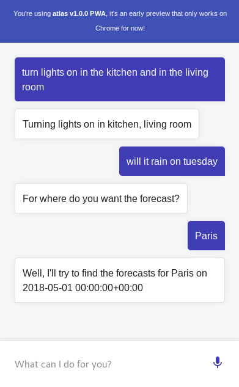

atlas
===


⚠️ This is an early version, so API may change in the future if this is needed! I'll try not to do so unless if there's no other possibilities.

**atlas** is a totally **open-source**, **self-hosted**, **interoperable** assistant written in Python 3 *(not tested with Python 2)*. It uses the MQTT protocol to communicate with third party skills.

Ever wanted to build your own Alexa, Siri or Google Assistant and host it yourself? That's why **atlas** has been created!

It manages dialog states with the help of the [transitions](https://github.com/pytransitions) library and parses natural language with [snips](https://github.com/snipsco/snips-nlu). If snips doesn't fit your needs, you can subclass the `Interpreter` class and make your own 😉

Have a look at the [📚 documentation folder](documentation).



## Installation

### PIP

Run `RUN pip install git+https://github.com/atlassistant/atlas-sdk.git && pip install git+https://github.com/atlassistant/atlas.git`

### Docker

- Build the image with `docker build . -t atlas`
- Run `docker run --rm -it -v <a folder containing an atlas.yml file>:/atlas -p 5000:5000 atlas`

### Manual

Install the **atlas-sdk** using [its own instructions](https://github.com/atlassistant/atlas-sdk).

Then, `git clone` this repository and run `python setup.py install`.

### NLU backends

Once installed, **atlas** will not have any dependency with a NLU backend. So you may want to install it yourself. Once done, don't forget to use the appropriated interpreter in the `atlas.yml` configuration file.

For example, if you use [snips-nlu](https://github.com/snipsco/snips-nlu), you must install it with `pip install snips-nlu` and use

```yml
interpreter: 
  type: 'atlas.interpreters.snips_interpreter.SnipsInterpreter'
```

in the atlas configuration file.

## Quickstart

⚠️ As of now, the application accessed from your `<server.url>` is not a valid PWA but it will be in a near future to be able to install it on your phone homescreen.

Starts with the prebuilt [sample](example) or make your own by reading below.

Those quick steps use Snips as the NLU backend.

- Once installed, you must configure it using a [configuration file](documentation/CONFIGURATION.md).
- Drop your training files (appropriate for your backend) into the `<loader.training_path>`, you may use a tool such as [tracy](https://github.com/YuukanOO/tracy) or [chatito](https://github.com/rodrigopivi/Chatito) to generates it.
- Drop your configuration files into the `<loader.env_path>`.
- Drop some skills scripts inside `<executor.path>`, each one should be in its own subfolder with an `atlas` file containing the command to run to executes your skill
- Start a MQTT broker, such as [mosquitto](https://mosquitto.org/)
- Start atlas with `atlas -c <your_configuration_file_path>.yml`
- Go to the `<server.url>` in your favorite browser to access the exposed PWA! (you may use another channel if you prefer). By default it uses the `en-US` language, if you want to change it, just add a query parameters such as `http://localhost:5000?lang=fr-FR`
- That's it!

I encourage you to read the [architecture overview](documentation/OVERVIEW.md) if you want to know how it works alltogether.

## Deploying

If you want the exposed PWA to work on your mobile device, you will have to use a valid certificate since this is required by web browsers for the Web Speech API to use your mic.

Please note that the Web Speech API used by the PWA only works in Chrome as far as I know.

## Contributing

Contributions are welcome! 

You're a developer or just want to know where this project is heading to? Have a look at the [extended TODO](TODO.md) file.

You want to support **atlas** by giving some money? Head over to Liberapay with this tiny button [](https://liberapay.com/YuukanOO/donate), thanks ❤️!

## Credits

- [Photo Sphere by Denis Klyuchnikov from the Noun Project](https://thenounproject.com/denis.klyuchnikov.1/uploads/?i=569622) (Logo)
- [snips-nlu](https://github.com/snipsco/snips-nlu) (base interpreter)
- [transitions](https://github.com/pytransitions/transitions) (dialog management)
