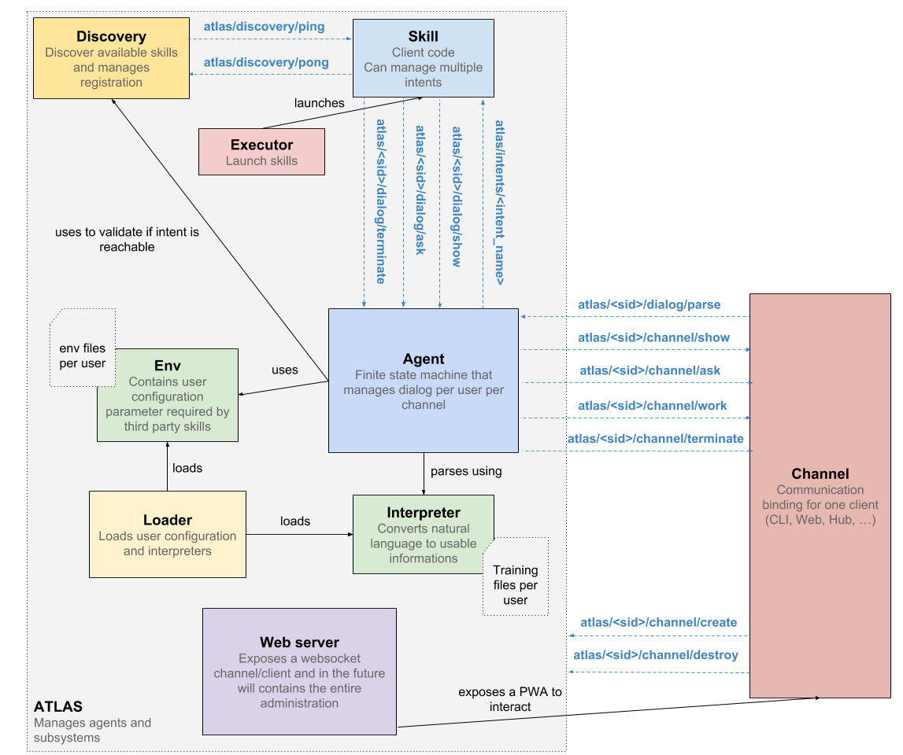

Overview
===

Here is a peek at **atlas** inner working. Each part handle one responsibility.

**atlas** is logically divided into **3** parts:

- **Communication**: this is the `Channel` part. It manages communication with the **atlas** system via multiple clients
- **Comprehension**: this is the `Interpreter` part where the system is trained with samples and defines how natural language will be understood by an `Agent`
- **Execution**: when the intent has been determined by the comprehension part, the registered `SKill` for this intent will be called and if some slots are missing, the `Skill` itself can ask for further informations and then present information to the end user

**atlas** is the core system which handle those subsystems.

## Loader

Read the filesystem to load **environments** and **interpreters** per user. Filenames are important here! In order to make **atlas** databaseless, filenames identify users settings and training files.

## Executor

It makes running skills a breeze. It will look inside a specific folder to find an `atlas` file which contains the command to run and executes it. By deploying your skills in this folder, they will be run at **atlas** startup. You are free to launch them by yourself if you prefer. Skills in this folder will receive the broker configuration from **atlas** by args parameters.

## Discovery

It manages skills registration. At specified interval, it will send a `ping` and listen for all `pong` sent by running skills.

## Interpreter

Parses natural language into usable representation. It is also used to retrieve every valid transitions from one state to another by looking at intents and their respective slots when an agent is created. With this tiny routine, we can ensure a skill cannot ask for a slot it doesn't have to know about.

## Agent

It represents the dialog engine. Implemented with a finite state machine, it handles state transition when a new intent is parsed and called the appropriate skill with metadata (by publishing to a specific topic).

It manages multi-turn dialogs by forwarding input request made by a `SKill` to the `Channel` and transitioning to a particular *ask* state as needed.

Agents are totally language agnostics. The internationalization support is done in skills.

## Channel

Consider it as a client for the **atlas** core system. It can be anything you want. A CLI and a PWA has been already implemented to provide a quickstart and test experience.

## Skill

Skill developers, this is where you will spend most of your time. Use the SDK in your favorite language ([Python](https://github.com/atlassistant/atlas-sdk) only for now) to make the development experience a breeze or subscribe and publish to the raw MQTT topics in your favorite language.

Skills are also responsible of internationalizing data. They received the user language when they are called.

Skills communicate directly with agents to ask for particular slots. Why? Imagine a weather skill which needs a location. The user has entered an ambiguous city as seen by the skill itself when retrieving weather data (by fetching an external API) so it can ask the user to give a more precise location and finally gives the weather forecast for the correct one.
